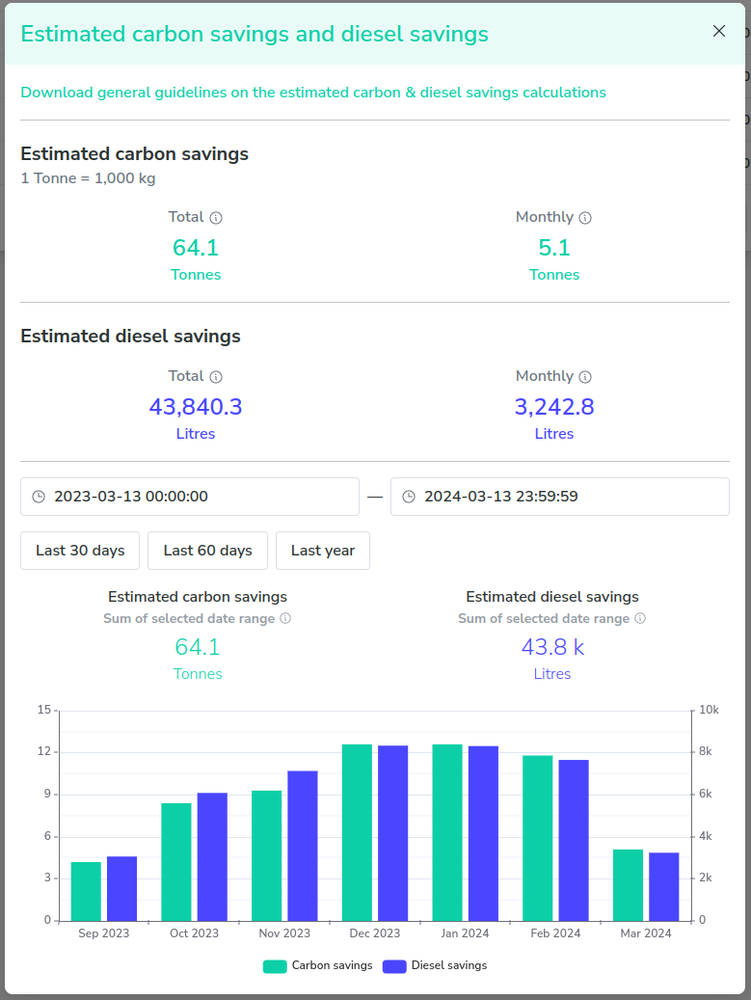

# Take-home coding exercise

- Create a new GitHub repository, the name should be generated by https://www.uuidgenerator.net/guid
- Use node.js v18.19.0 for this exercise
- The data can be store in a file, or in memory, or in a database, it's up to you
- The code will be run in Mac OSX / Linux for testing, if you are using Windows, please make sure the code can run in Mac OSX / Linux

## Goal

Create a simple API (either RESTFul or GraphQL) that allows the following UI to work

At Ampd Energy, we help our customer to reduce their carbon footprint by replacing diesel generators with our energy storage system. We measure our energy input and output of our system, and calculate the carbon savings for our customers.

This UI is a mockup of a device saving graph, it allows the user to filter a device's saving data by date range, the graph can be zoomed in and out, and the maximum zoom level is 1 day.

Mock data are provided under `./data` folder, you can use them to create your API

## Requirements

- API should be able to fulfill the UI requirements
- The application should be able to run in a Mac OSX / Linux environment

## Bonus

Extra points if you can provide a simple UI to interact with the API, we recommend using Vue.js and echarts.js for drawing the graph